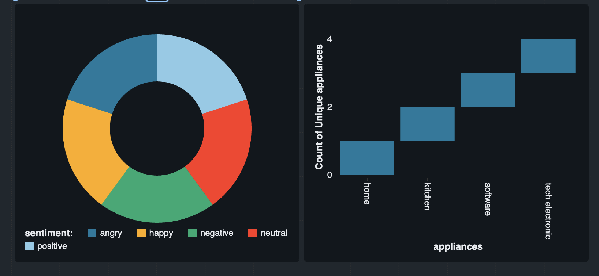
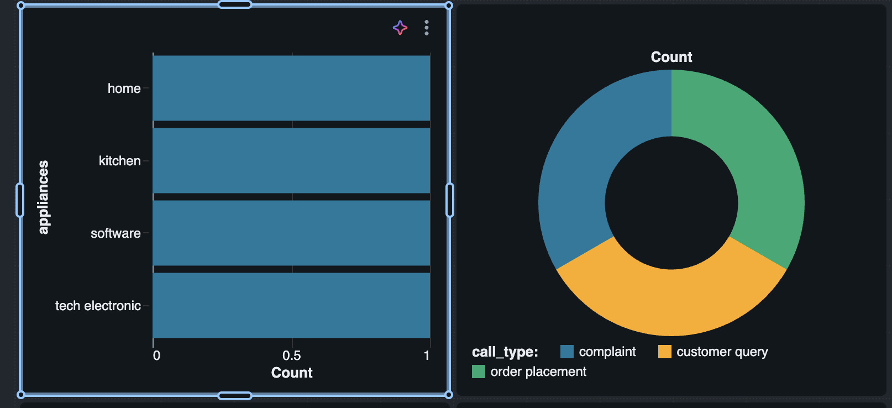

# Databricks Medallion Transcript Pipeline

An end-to-end data pipeline on Databricks that ingests raw customer service call transcripts and uses **Databricks AI Functions** (built-in SQL functions backed by an LLM) to extract structured information, classify calls, and analyze sentiment — all without calling an external API.

## What it does

Raw call transcripts move through the classic **medallion architecture** (bronze → silver → gold), gaining structure and analytical value at each stage:

- **Bronze** — Ingests `call_transcripts.csv` as-is, adding a content hash (`uuid`) and ingestion timestamp for traceability.
- **Silver** — Uses `ai_extract()` to pull `caller_name`, `product_name`, and `order_number` out of the free-text transcript, and `ai_classify()` to tag each call's `call_type` (complaint / order placement / customer query) and `sentiment` (positive / neutral / negative / angry / happy).
- **Gold** — Classifies each call's product into a category (kitchen, home, tech electronic, software, bathroom, sports) via `ai_classify()`, and partitions the table by date.
- **Derivative** — Aggregates the gold table into three summary tables: call counts by appliance category, by sentiment, and by call type.

A Lakeview dashboard (`New Dashboard ...json`) visualizes the derivative-layer results.

## Catalog structure

```
dbxtutorial (catalog)
├── bronze.bronze_table        # raw + hashed transcripts
├── silver.silver_table        # extracted fields + classifications
├── gold.gold_table             # + appliance category, partitioned by date
└── derivative
    ├── count_appliances
    ├── count_sentiment
    └── count_calltype
```

## Dashboard

The derivative-layer tables feed a Lakeview dashboard that visualizes call sentiment, appliance category, and call type breakdowns.




## Notebooks

| File | Purpose |
|---|---|
| `bronze_layer.py` | Ingest raw CSV, add uuid + timestamp |
| `silver_layer.py` | AI-powered field extraction + classification |
| `gold_layer.py` | Product categorization, date partitioning |
| `derivative_layer.py` | Aggregate counts for reporting |
| `partition.py` | Utility notebook to inspect table partitioning |

## Tech stack

- Databricks (Serverless SQL Warehouse, Unity Catalog)
- PySpark / Delta Lake
- Databricks AI Functions (`ai_extract`, `ai_classify`)

## Notes

- `silver_layer.py` currently processes a `LIMIT 200` subset of bronze data — remove this if you want the full dataset to flow through to gold/derivative.
- Tables are written in `overwrite` mode, so reruns replace the prior snapshot rather than appending.

## Author

Abhishek — [GitHub](https://github.com/Abhi-singhh)
